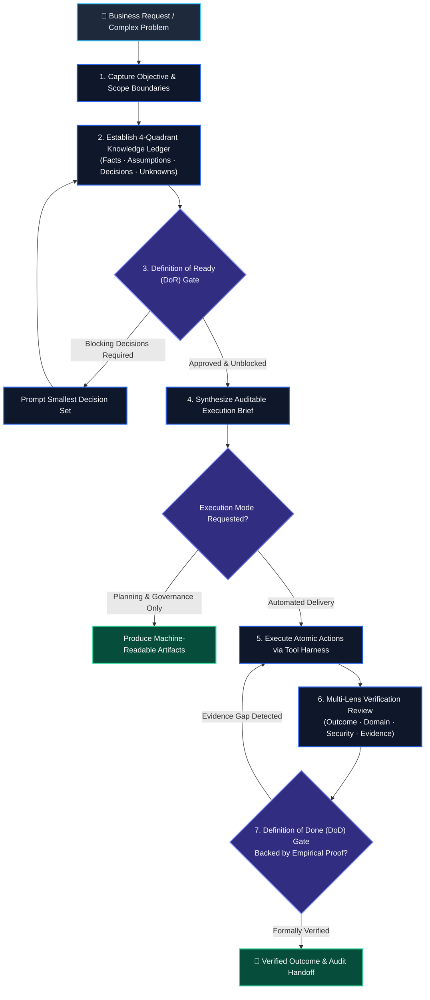

<div align="center">

# Get Things Done (GTD)

**Autonomous Work Modeling, Deterministic Delivery & Governance Engine for AI Agents.**  
*Transforming unstructured intent into verified, auditable, and production-ready outcomes across enterprise teams.*

[](https://github.com/imMamdouhaboammar/get-things-done-skillpack/actions/workflows/ci.yml)
[](https://www.python.org/downloads/)
[](LICENSE)
[](skills/)
[](skills/)

</div>

---

## 🏢 Executive Summary

Modern enterprise AI deployments face a recurring challenge: **AI models generate plausible-sounding plans but fail at deterministic execution, hallucinate completion, and obscure critical project unknowns.**

The **Get Things Done (GTD) Skill Pack** provides a standardized, schema-driven operational runtime that enforces rigorous governance, strict quality gating, and empirical verification across any LLM or AI agent harness.

```
┌─────────────────────────────────────────────────────────────────────────────┐
│                            ENTERPRISE CORE VALUE                            │
├───────────────────────┬────────────────────────────┬────────────────────────┤
│  Zero "Fake-Done"     │  Knowledge Isolation       │  Domain Governance     │
│  Empirical proof is   │  Facts, Assumptions,       │  Extensible domain     │
│  mandated before any  │  Decisions & Unknowns      │  packs without         │
│  task is marked done. │  are strictly tracked.     │  forking core rules.   │
└───────────────────────┴────────────────────────────┴────────────────────────┘
```

---

## 🏛️ Core Architectural Pillars

### 1. Four-Quadrant Knowledge Ledger
Ambiguity is decomposed into four discrete, auditable categories before execution begins:
- **Facts**: Verified truths backed by inspectable environment or codebase evidence.
- **Assumptions**: Reversible, low-risk operational choices made without user interruption.
- **Decisions**: Irreversible or high-impact branching points requiring explicit stakeholder approval.
- **Unknowns**: Identified gaps that must be resolved prior to advancing work.

### 2. Dual Quality Gating
- **Definition of Ready (DoR)**: Prevents premature execution by verifying scope containment, stakeholder decisions, and dependency availability.
- **Definition of Done (DoD)**: Forbids conversational or subjective completion assertions. An outcome is only marked complete when backed by executable verification and observable evidence.

### 3. Isolated Domain Governance
Domain packs (Software Engineering, Product Management, Marketing Strategy, Research & Analytics) inherit the core governance contract without code modification, establishing standardized domain vocabulary, specialized diagnostic questions, and custom completion criteria.

### 4. Universal Host Interoperability
Engineered as native Agent Skills and packaged with standardized OpenAI and Claude manifests, GTD integrates seamlessly with **Claude Code**, **ChatGPT Enterprise / GPTs**, **Codex**, **Gemini CLI**, **Google Antigravity**, and **OpenClaw**.

---

## 📦 The Skill Catalog

| Skill | Logo | Focus Area | Brand Hex | Enterprise Interface |
|---|:---:|---|---|---|
| **[`get-things-done`](skills/get-things-done)** |  | Strategic Execution & Delivery | `#2563EB` | Schema-driven work modeling, diagnostic routing, and verified task delivery. |
| **[`building-gtd-domain-packs`](skills/building-gtd-domain-packs)** |  | Extension Architecture | `#059669` | Enterprise framework for creating organizational and field-specific domain packs. |

---

## 🔄 Enterprise Execution Lifecycle



---

## 📋 The Execution Brief Artifact

Every substantial project state is captured in a typed, schema-validated **Execution Brief** (`v1.0`). This artifact provides a reproducible audit trail for compliance and handoff across human teams and agent systems:

```json
{
  "version": "1.0",
  "title": "Production Auth & RBAC Hardening",
  "status": "ready",
  "domain": "software",
  "intent": {
    "problem": "Legacy token validation lacks granular scope verification.",
    "desired_outcome": "Zero-trust session authorization with automated revoke tests.",
    "actor": "Security Engineering"
  },
  "knowledge": {
    "facts": ["Existing service runs Python 3.12 with FastAPI."],
    "assumptions": ["Redis session store maintains < 5ms latency SLA."],
    "unknowns": []
  },
  "verification": {
    "success_criteria": ["All auth unit and integration tests pass green."],
    "evidence": ["test_rbac_revocation: PASSED (24 assertions)"]
  }
}
```

---

## ⚡ Enterprise CLI Reference

The GTD CLI provides automated validation, brief scaffolding, and packaging utilities for enterprise automation pipelines:

### System Diagnostics & Health Check
```bash
# Verify integrity of core contracts, schemas, and loaded domain packs
python scripts/gtd.py doctor
```

### Governance & Schema Validation
```bash
# Validate an Execution Brief against the strict JSON Schema and loaded domain
python scripts/gtd.py validate-brief brief.json

# Render an Execution Brief into an executive Markdown report
python scripts/gtd.py render-brief brief.json --out executive-brief.md
```

### Domain Pack Scaffolding
```bash
# Scaffold an organization-specific domain pack conforming to core contracts
python scripts/gtd.py new-domain compliance --name "Regulatory Compliance" --output skills/get-things-done/domains/compliance.md
```

### Distribution Packaging
```bash
# Build standalone, zero-dependency ZIP archives for ChatGPT Enterprise / Codex
python scripts/gtd.py package --out ./dist
```

---

## 🚀 Deployment & Integration

### 1. Enterprise Agent Workspaces (Centralized / Fleet)

Deploy GTD directly into user or shared agent skill directories:

```bash
# Deploy to universal agent registry (~/.agents/skills)
./install.sh --agents

# Deploy to Claude Code (~/.claude/skills)
./install.sh --claude

# Deploy to both registries with forced sync
./install.sh --both --force
```

### 2. ChatGPT Enterprise & OpenAI Codex

1. Generate distribution archives:
   ```bash
   python scripts/gtd.py package --out dist/
   ```
2. In your ChatGPT Enterprise workspace or GPT builder, upload `dist/get-things-done.zip`.
3. The bundle includes full standalone domain packs, execution schemas, templates, and SVG assets.

### 3. CI/CD Governance Pipeline

Integrate brief validation directly into GitHub Actions, GitLab CI, or Jenkins:

```yaml
- name: Verify Execution Brief
  run: |
    python scripts/gtd.py validate-brief ./docs/plans/project-brief.json
```

---

## 🔒 Security, Privacy & Compliance

- **Zero Outbound Telemetry**: Operates entirely within your local execution environment or private agent harness.
- **Air-Gapped Compatible**: Self-contained with no external runtime API or network dependencies.
- **No Credential Exposure**: Never requires or stores API keys, database credentials, or sensitive tokens.
- **Auditable Artifacts**: All decisions, assumptions, and proofs are recorded in plain-text markdown and JSON.

---

## 📄 License & Attribution

Distributed under the **MIT License**. See [`LICENSE`](LICENSE) for terms.

Authored & Maintained by [Mamdouh Aboammar](https://github.com/imMamdouhaboammar).
