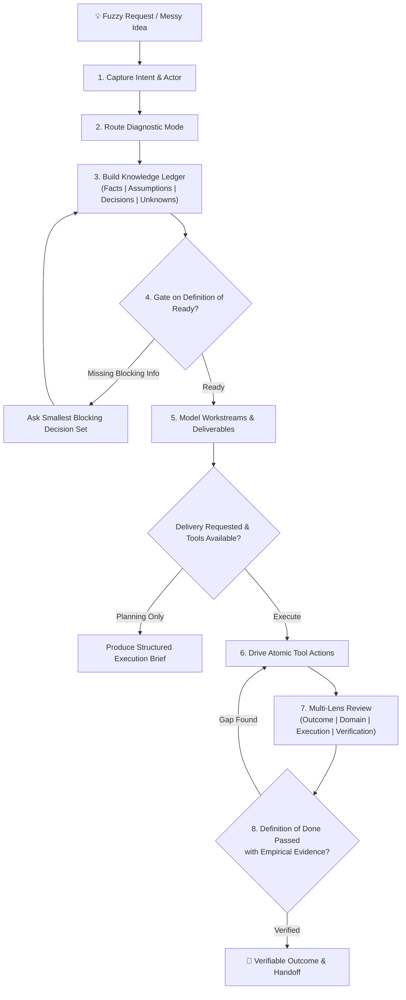

<div align="center">

# Get Things Done (GTD)

**The autonomous execution and work modeling engine for AI agents.**  
*Convert messy, unclear ideas into verifiable, executable work models and deliver real outcomes.*

[](https://github.com/imMamdouhaboammar/get-things-done-skillpack/actions/workflows/ci.yml)
[](https://www.python.org/downloads/)
[](LICENSE)
[](skills/)

</div>

---

## 🎯 Overview

**Get Things Done** is an open, multi-agent skill pack that bridges the gap between high-level human ambiguity and deterministic, verifiable execution. 

Unlike traditional task managers or superficial chat bots, this skill pack equips AI agents (Claude Code, ChatGPT, Codex, Gemini CLI, Google Antigravity, OpenClaw) with a rigorous operational loop:
1. **Separating Problem from Solution**: Clarifying the real outcome before prescribing code or actions.
2. **Four-Quadrant Knowledge Ledger**: Explicitly tracking **Facts**, **Assumptions**, **Decisions**, and **Unknowns**.
3. **Definition of Ready (DoR)**: Gating execution until blockers and critical decisions are resolved.
4. **Definition of Done (DoD)**: Requiring observable, empirical evidence before claiming completion (eliminating "fake-done" hallucinations).
5. **Domain Extensibility**: Inheriting domain packs (Software, Marketing, Product, Research, etc.) without forking core invariants.

---

## 📦 The Skill Catalog

This repository contains two production-grade, independently packaged Agent Skills styled and validated under the **Skill Catalog Stylist** standard:

| Skill | Logo | Category | Brand Color | Description |
|---|:---:|---|---|---|
| [`get-things-done`](skills/get-things-done) |  | Strategic Execution | `#2563EB` | Converts fuzzy, chaotic requests into executable work models and drives verifiable completion. |
| [`building-gtd-domain-packs`](skills/building-gtd-domain-packs) |  | Architecture & Extensibility | `#059669` | Author and validate domain packs that extend GTD vocabulary and checks without modifying core invariants. |

---

## 🔄 The GTD Execution Loop



---

## 🗂️ Repository Structure

```
get-things-done-skillpack/
├── skills/
│   ├── get-things-done/                   # Canonical runtime skill
│   │   ├── SKILL.md                       # Agent instructions & prompt contract
│   │   ├── assets/                        # High-contrast 128px & 512px SVG brand assets
│   │   │   ├── small-logo.svg
│   │   │   └── large-logo.svg
│   │   ├── agents/
│   │   │   └── openai.yaml                # OpenAI / ChatGPT plugin manifest
│   │   ├── domains/                       # Pre-baked domain packs
│   │   │   ├── software.md
│   │   │   ├── marketing.md
│   │   │   ├── product.md
│   │   │   └── research.md
│   │   ├── references/                    # Schemas and specifications
│   │   │   ├── core-contract.md
│   │   │   ├── domain-pack-spec.md
│   │   │   └── execution-brief.schema.json
│   │   ├── templates/                     # Markdown report templates
│   │   │   └── execution-brief.md
│   │   └── scripts/
│   │       └── gtd.py                     # Canonical deterministic CLI
│   └── building-gtd-domain-packs/         # Extension authoring skill
│       ├── SKILL.md
│       ├── assets/
│       │   ├── small-logo.svg
│       │   └── large-logo.svg
│       ├── agents/
│       │   └── openai.yaml
│       ├── references/
│       │   ├── core-contract.md
│       │   └── domain-pack-spec.md
│       └── templates/
│           └── domain-pack-template.md
├── scripts/
│   ├── gtd.py                             # Pack-level CLI wrapper
│   ├── catalog_stylist.py                 # Skill Catalog Stylist generator & validator
│   └── package_skills.py                  # Standalone ZIP builder for ChatGPT / Codex
├── evals/
│   ├── cases.jsonl                        # Pressure-testing behavioral evals
│   └── README.md
├── examples/                              # Validated example execution briefs
│   ├── software-brief.json
│   └── marketing-brief.json
├── tests/                                 # Automated Pytest suite
│   ├── test_pack.py
│   └── test_catalog_assets.py
├── .github/workflows/                     # CI & Release automation
│   ├── ci.yml
│   └── release.yml
├── install.sh                             # Cross-agent installer script
├── pyproject.toml                         # Standard Python packaging configuration
└── LICENSE                                # MIT License
```

---

## 🚀 Quickstart & CLI Reference

The deterministic CLI provides instant validation, scaffolding, and packaging utilities:

### 1. Run Health Check
```bash
python scripts/gtd.py doctor
```

### 2. List Supported Domain Packs
```bash
python scripts/gtd.py list-domains
```

### 3. Scaffold & Validate an Execution Brief
```bash
# Generate a clean execution brief scaffold
python scripts/gtd.py new-brief --title "Refactor Auth Pipeline" --domain software --out brief.json

# Validate against the strict JSON schema and loaded domain
python scripts/gtd.py validate-brief brief.json

# Render into human-friendly markdown
python scripts/gtd.py render-brief brief.json --out brief.md
```

### 4. Create a New Domain Pack
```bash
python scripts/gtd.py new-domain devops --name "DevOps & SRE" --output skills/get-things-done/domains/devops.md
```

### 5. Build Standalone Distribution ZIP Bundles
```bash
python scripts/gtd.py package --out ./dist
```

---

## 🎨 Skill Catalog Stylist & Store Compliance

Both skills strictly adhere to public plugin and skill store quality standards:
- **Small SVG Logo (`128x128`)**: Retina-ready, high-contrast geometric glyph with squircle backdrop.
- **Large SVG Logo (`512x512`)**: Detailed vector composition with gradient illumination and precision geometry.
- **OpenAI Agent Manifest (`agents/openai.yaml`)**:
  - `display_name` $\le 40$ characters.
  - `short_description` $\le 80$ characters.
  - `default_prompt` single line $\le 128$ characters.
  - `brand_color` 6-character hex strictly mapped to SVG palette.

You can validate all assets at any time with:
```bash
python scripts/catalog_stylist.py --validate
```

---

## 📥 Installation

### Fast Local Install (Script)

Install into standard agent skills directories:

```bash
# Install to ~/.agents/skills (Claude Code, Gemini CLI, Antigravity, OpenClaw)
./install.sh --agents

# Install to ~/.claude/skills (Claude Code)
./install.sh --claude

# Install to both locations
./install.sh --both

# Force overwrite existing installations
./install.sh --both --force
```

### ChatGPT & OpenAI Codex

1. Run `python scripts/gtd.py package --out dist/` to generate `dist/get-things-done.zip` and `dist/building-gtd-domain-packs.zip`.
2. In ChatGPT, navigate to **Explore GPTs > Create > Configure > Skills / Upload Files**.
3. Upload the standalone `get-things-done.zip`.

---

## 🧪 Testing & Behavioral Evals

```bash
# Run complete test suite (unit + catalog stylist preflight)
pytest -v

# Run with coverage
pytest --cov=scripts --cov=skills
```

Pressure test cases covering **fake-done prevention**, **wrong-domain rejection**, and **messy inputs** are located in [`evals/cases.jsonl`](evals/cases.jsonl).

---

## 📄 License

Distributed under the **MIT License**. See [`LICENSE`](LICENSE) for details.

Developed with ❤️ by [Mamdouh Aboammar](https://github.com/imMamdouhaboammar).
