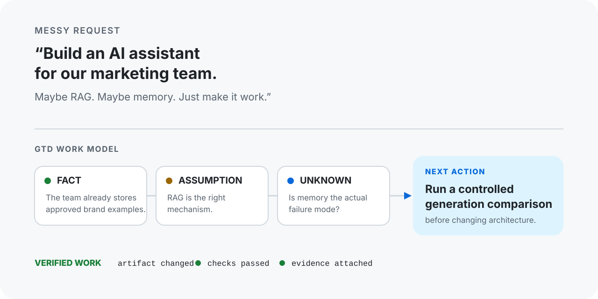
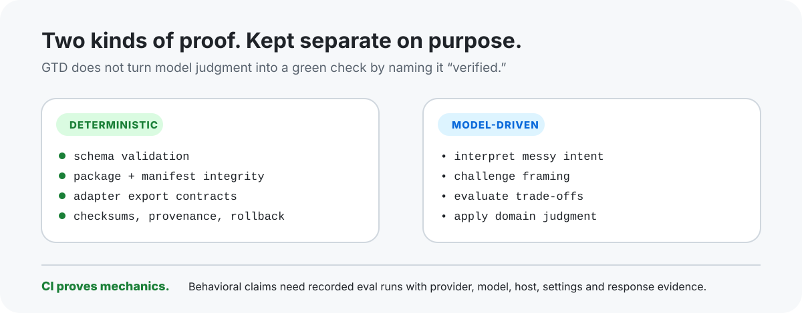
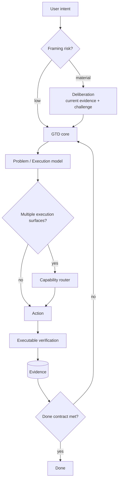

<div align="center">

# Get Things Done

**From messy intent to verified work.**

Give GTD the request before it is ready. It separates the outcome from the proposed solution, checks current facts when they matter, chooses the next executable action, and keeps "done" tied to evidence.

[](https://github.com/imMamdouhaboammar/get-things-done/actions/workflows/ci.yml)
[](pyproject.toml)
[](skills/)
[](LICENSE)

[Install](#install) · [See it work](#start-with-the-request-you-actually-have) · [How it works](#how-gtd-works) · [Verification](#two-kinds-of-proof) · [Docs](#documentation)

</div>

<p align="center">
  
</p>

## Start with the request you actually have

GTD is for work that arrives before it is clean enough to execute.

You can start with this:

> Build an AI assistant for our marketing team. Maybe RAG. Maybe memory. Just make it work.

A normal planning pass can turn that sentence into architecture very quickly. GTD first asks whether the architecture is solving the observed problem.

| GTD records | Example |
|---|---|
| **Outcome** | The team gets consistently brand-aware outputs |
| **Fact** | Approved brand examples already exist |
| **Assumption** | RAG is the right mechanism |
| **Unknown** | Memory is actually the failure mode |
| **Direction** | Test retrieval and generation quality before changing architecture |
| **Next action** | Run a controlled generation comparison |
| **Done evidence** | The promised result exists and the agreed checks pass |

The point is not a bigger plan. The point is to stop an untested solution from quietly becoming the task.

## Install

If your agent supports Agent Skills, this is the shortest path:

```bash
npx skills add imMamdouhaboammar/get-things-done --all
```

For the repository CLI, adapters, eval harness, and release tooling:

```bash
git clone https://github.com/imMamdouhaboammar/get-things-done.git
cd get-things-done
./install.sh --agents
python scripts/gtd.py doctor
```

The installer copies four canonical GTD Skills. It stages the replacement first and rolls back a failed forced update instead of leaving a half-installed set.

[Installation guide](docs/installation.md) · [Updating](docs/updating.md) · [Release and recovery](docs/release.md)

## What changes when GTD is in the loop

| Situation | GTD behavior |
|---|---|
| "I have an idea but I do not know where to start" | Separates the desired result from the first solution that came to mind |
| "I am sure the cause is X" | Treats X as a hypothesis until current evidence supports it |
| "Research this and then act" | Refreshes current external facts before they can steer the decision |
| "The PR was green yesterday" | Refreshes the current source of truth before landing |
| "Tell me this is done" | Requires evidence against the completion criteria |
| "That tool is unavailable" | Degrades honestly instead of pretending the action or verification happened |
| "This is a tiny reversible task" | Skips ceremony when acting or testing is cheaper than more analysis |

GTD is deliberately selective. A simple, fully specified task should stay simple.

## How GTD works

```text
messy request
     ↓
problem model
     ↓
current evidence + challenge
     ↓
approved direction
     ↓
next executable action
     ↓
act through available capabilities
     ↓
verify against evidence
     ↓
done, blocked, or next cycle
```

Three boundaries matter more than the names of the components.

**Thinking and execution are separate.** Deliberation can challenge framing, but it does not count as delivery.

**Tool availability and authority are separate.** A configured integration is not proof that it is connected, authorized, funded, or safe to use now.

**Implementation and completion are separate.** A changed file, generated draft, or confident agent report is not proof that the promised result exists.

For substantial work, GTD keeps those decisions in a portable [Execution Brief](docs/execution-brief.md) so another agent can continue without reconstructing the whole conversation.

## Two kinds of proof

<p align="center">
  
</p>

GTD contains deterministic mechanics and model-driven judgment. It does not pretend they have the same evidence standard.

| Deterministic | Model-driven |
|---|---|
| JSON Schema and semantic validation | interpreting messy intent |
| package, manifest, and Skill contract checks | deciding which unknown matters now |
| adapter export contracts | challenging or reframing a proposed solution |
| deterministic packaging and SHA-256 checks | evaluating trade-offs |
| transactional install/update rollback | applying domain judgment |
| release provenance | deciding whether more thought has higher value than action |

CI can prove the left column. The right column needs behavioral evidence.

That boundary is intentional. A green CI badge does not mean a language model made a good decision.

## Agent behavior is a testable claim

The repository ships a behavioral recorder and comparator instead of a self-awarded benchmark score.

A run records:

- suite SHA-256 and exact source commit
- provider, model, host, and settings
- response SHA-256 for each case
- named expected behaviors
- named forbidden behaviors
- grader kind and identity
- derived pass/fail

Create controlled baseline and candidate records:

```bash
python scripts/behavioral_evals.py new-run \
  --suite evals/cases.jsonl \
  --label baseline \
  --provider PROVIDER \
  --model MODEL \
  --host HOST \
  --source-sha BASELINE_SHA \
  --skill-mode without_skill \
  --out baseline.json

python scripts/behavioral_evals.py new-run \
  --suite evals/cases.jsonl \
  --label candidate \
  --provider PROVIDER \
  --model MODEL \
  --host HOST \
  --source-sha CANDIDATE_SHA \
  --skill-mode with_skill \
  --out candidate.json
```

The comparator refuses to compare runs when the suite or provider/model/host/settings drift.

The repository does **not** claim a behavioral improvement percentage until an actual controlled baseline and candidate run exist.

[Evaluation protocol](docs/evaluation.md) · [Evaluation corpora](evals/README.md)

## Four Skills, one execution contract

The repository ships four canonical Skills. They compose around one core rather than maintaining four competing workflows.

| Skill | Job |
|---|---|
| [`get-things-done`](skills/get-things-done/) | Owns the work model, blocker mode, Ready/Done gates, execution state, evidence, and handoff |
| [`gtd-deliberation`](skills/gtd-deliberation/) | Challenges assumption-heavy or expensive-to-reverse framing before implementation planning |
| [`gtd-capability-router`](skills/gtd-capability-router/) | Chooses the smallest safe set of available sources, writers, verifiers, reviewers, and landing owners |
| [`building-gtd-domain-packs`](skills/building-gtd-domain-packs/) | Creates specialist domain packs without forking the core contract |

The normal path is:

```text
intent
  → deliberation when framing risk is material
  → GTD work state
  → capability routing when execution has multiple possible surfaces
  → action
  → verification
```

## Domain packs

GTD loads zero or one specialist pack when field-specific reasoning materially changes diagnosis or completion evidence. A keyword match is not enough.

| Pack | Adds |
|---|---|
| Software | interfaces, failure modes, tests, migrations, deployment evidence |
| Marketing | audience, offer, channel role, measurement, experiments |
| Product | user behavior, scope, requirements, product outcomes |
| Research | source quality, contradictions, uncertainty, reproducibility |
| Advisory | dilemmas, reversibility, strategic trade-offs |
| Data & AI | datasets, ML experiments, evaluation, reproducibility |
| Design & UX | user observation, prototypes, systems, accessibility |
| Operations | incidents, SLOs, rollback, runbooks, confirmation monitoring |
| Legal & Compliance | jurisdiction, applicability, risk, remediation ownership |

Need another domain? Use [`building-gtd-domain-packs`](skills/building-gtd-domain-packs/) instead of editing the core.

[Domain pack contract](docs/domain-packs.md)

## Works where your agent works

GTD keeps one canonical `skills/` tree and projects it into host-specific delivery formats. The adapter layer is packaging and discovery, not a second execution model.

Current adapter contracts cover **20 targets**, including:

`Agent Skills` · `Agent Plugins` · `Claude AI` · `Claude Code` · `Claude Marketplace` · `Claude Cowork` · `ChatGPT Web` · `ChatGPT Work` · `ChatGPT Plugins` · `Codex` · `Cursor` · `Kimi Code` · `Grok Build` · `DeepSeek DeepCode` · `Antigravity / Gemini CLI` · `Homebrew` · `Shell` · `skills.sh` · `Skill Kit` · `Glama`

Support labels describe what this repository verifies. They do not imply vendor marketplace approval.

Glama remains conditional because GTD does not currently ship an MCP server. The exporter fails closed instead of manufacturing support that is not there.

[Adapter matrix and export commands](docs/adapters.md)

## The Execution Brief

The Execution Brief is the durable boundary between thinking, execution, verification, and handoff.

A v2 brief keeps the important parts explicit. This is an excerpt, not the full schema:

```json
{
  "version": "2.0",
  "title": "Brand-aware generation",
  "status": "modeling",
  "outcome": {
    "desired_result": "Generated pages follow supplied brand direction"
  },
  "knowledge": {
    "facts": [],
    "assumptions": [],
    "unknowns": []
  },
  "workstreams": [],
  "verification": {
    "criteria": [],
    "evidence": []
  },
  "next_action": {
    "description": "Run the controlled comparison"
  }
}
```

The full schema tracks authority, attempts, reviews, workstreams, deliverables, evidence freshness, blockers, plan changes, and handoffs.

[Execution Brief](docs/execution-brief.md) · [Validation architecture](docs/validation.md) · [Examples](examples/)

## Architecture



The `skills/` tree is the source of truth. Adapters can change where GTD is discovered and packaged, but they cannot fork the work model or weaken Ready/Done semantics.

[Architecture](docs/architecture.md) · [Core contract](skills/get-things-done/references/core-contract.md)

## Install and update paths

Choose the authority that installed your copy.

| Install path | Install / update authority |
|---|---|
| Agent Skills / skills.sh | `npx skills add ...` / `npx skills update` |
| Canonical installed GTD Skills | `gtd update --check` / `gtd update` |
| Git checkout | `git pull --ff-only` |
| Homebrew HEAD | `brew upgrade --fetch-HEAD get-things-done` |
| Named host root | `./install.sh --target <host>` or `--target-path <path>` |

The self-updater stages and validates all four Skills before replacement, preserves non-colliding custom domain files, records canonical hashes, and requires `--force` before overwriting later local edits.

[Updating contract](docs/updating.md)

<details>
<summary><strong>CLI reference</strong></summary>

### GTD core

```bash
python scripts/gtd.py doctor
python scripts/gtd.py list-domains
python scripts/gtd.py new-brief --version 2.0 --title "…" --out brief.json
python scripts/gtd.py validate-brief brief.json --root .
python scripts/gtd.py assess-brief brief.json --require ready
python scripts/gtd.py render-brief brief.json --out brief.md
python scripts/gtd.py migrate-brief legacy-v1.json --out brief-v2.json
python scripts/gtd.py package --out dist
python scripts/gtd.py update --check
```

### Adapter CLI

```bash
python scripts/adapters.py validate
python scripts/adapters.py status
python scripts/adapters.py capabilities
python scripts/adapters.py export cursor --out dist/adapters
python scripts/adapters.py export-all --out dist/adapters --package --report dist/export-report.json
```

### Release integrity

```bash
python scripts/release_checksums.py dist --verify dist/SHA256SUMS
```

</details>

## Repository guarantees

Current deterministic CI runs on Python **3.10, 3.11, 3.12, 3.13, and 3.14** and covers the repository contracts that can be checked mechanically, including:

- Execution Brief schemas and semantic relationships
- domain pack and routing invariants
- adapter and plugin manifests
- package installation and the `gtd` entrypoint
- host exports and deterministic archives
- installer and updater rollback paths
- release checksums and provenance
- behavioral suite and run-record structure

Behavioral reasoning remains a separate qualification activity. See [Evaluation](docs/evaluation.md).

## Documentation

| Start here | Reference |
|---|---|
| [Quickstart](docs/quickstart.md) | First GTD workflow |
| [Installation](docs/installation.md) | Host-specific installation and export paths |
| [Architecture](docs/architecture.md) | Runtime model and boundaries |
| [Deliberation](docs/deliberation.md) | Freshness, challenge, direction gate, backlog |
| [Execution Brief](docs/execution-brief.md) | Durable work artifact and lifecycle |
| [Validation](docs/validation.md) | Schema ownership, migration, CLI exit semantics |
| [Domain packs](docs/domain-packs.md) | Selection and custom pack authoring |
| [Adapters](docs/adapters.md) | 20 host/distribution contracts |
| [Evaluation](docs/evaluation.md) | Behavioral run and comparison protocol |
| [CI quality](docs/ci.md) | Runtime, package, lint, permission policy |
| [Updating](docs/updating.md) | Self-update safety and channels |
| [Release and recovery](docs/release.md) | Transactions, provenance, rollback |

## Contributing

Before opening a PR:

```bash
python scripts/gtd.py doctor
python scripts/adapters.py validate
pytest
```

If you add a host adapter, update its registry contract and export tests. If you add a domain, preserve the core Ready/Done and evidence semantics.

## License

MIT. See [LICENSE](LICENSE).

Maintained by [Mamdouh Aboammar](https://github.com/imMamdouhaboammar).
